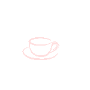

# TheLabDesk

[![Kotools Types][kotools-types-badge]][kotools-types-project]
[![Kotlin][kotlin-badge]][kotlin]
[![kotlinx.serialization][kotlinx.serialization-badge]][kotlinx.serialization]

## Description

TheLabDesk is another version of [***TheLab***](https://github.com/MichaelStH/TheLab), a *Desktop* application
originally developed
on Android mobile to show several use-cases of Google's Android Material and Jetpack Compose components such as (Compose
Components, CardView,
RecyclerView, so on and so forth).

It's still in development, then this app may contain bugs and crashes

## Libraries
- [Compose for Desktop][jetpack-compose]

## Versioning

This repository use *Git* as the main versioning tool and follows [*Semantic Versioning*][sem-ver]
principles.

## Related Apps

* [***Material Design***](https://github.com/MichaelStH/MaterialDesignFeatures)
* [***Testing***](https://github.com/MichaelStH/Testing/tree/develop)
* [***TheKoLab***](https://github.com/LVMVRQUXL/thekolab/tree/master) (Repository created and maintained by LAMARQUE
  Loïc ([*@LVMVRQUXL*](https://github.com/LVMVRQUXL) on *Github*))

## Authors

Repository created and maintained by Saint-Honoré Michaël ([*@MichaelStH*](https://github.com/MichaelStH) on *Github*).

[sem-ver]: https://semver.org/
[kotools-types-badge]: https://img.shields.io/static/v1?label=version&message=1.0.0&color=blue
[kotools-types-project]: https://github.com/kotools/types
[kotlin]: https://kotlinlang.org
[kotlin-badge]: https://img.shields.io/badge/kotlin-1.9.10-blue?logo=kotlin
[kotlin.ArithmeticException]: https://kotlinlang.org/api/latest/jvm/stdlib/kotlin/-arithmetic-exception
[kotlinx.serialization]: https://github.com/Kotlin/kotlinx.serialization
[kotlinx.serialization-badge]: https://img.shields.io/badge/kotlinx.serialization-1.5.1-blue
[total-functions]: https://xlinux.nist.gov/dads/HTML/totalfunc.html
[jetpack-compose]: https://www.jetbrains.com/lp/compose-multiplatform/